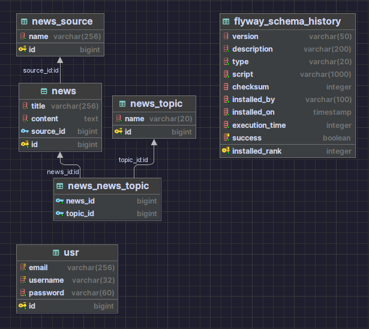

# Backend Test Assignment for the STRONG TEAM Summer Internship

Spring Boot is an application for storing, processing and displaying news

## Used technologies:
    1. Gradle
    2. Spring boot (Web, Security, Data JPA, Validation)
    3. Lombok
    4. Postgres
    5. Flyway
    6. JWT

## Database diagram


## Run project via docker compose
```shell
    mv src/main/java/resources/application.example.yml src/main/java/resources/application.local.yml
    docker compose up
```

## Part 1: REST service
1. GET, POST, PUT, DELETE methods for news sources
   1. GET - /api/news-sources/{id}
   2. POST - /api/news-sources
   3. PUT - /api/news-sources/{id}
   4. DELETE - /api/news-sources/{id}
2. GET, POST, PUT, DELETE methods for news
    1. GET - /api/news/{id}
    2. POST - /api/news
    3. PUT - /api/news/{id}
    4. DELETE - /api/news/{id}
3. GET, POST, PUT, DELETE methods for news topics
    1. GET - /api/news-topics/{id}
    2. POST - /api/news-topics
    3. PUT - /api/news-topics/{id}
    4. DELETE - /api/news-topics/{id}
4. GET method for getting list of all news sources
    1. GET - /api/news-sources
5. GET method for getting list of all news topics
    1. GET - /api/news-topics
6. GET method for getting list of all news (with pagination)
    1. GET - /api/news?page=0&pageSize=10
7. GET method for getting list of news by source id (with pagination)
    1. GET - /api/news/by-source/{sourceId}?page=0&pageSize=10
8. GET method for getting list of news by topic id (with pagination)
    1. GET - /api/news/by-topic/{topicId}?page=0&pageSize=10 

## Part 2: Security with API 
I use spring security. Unfortunately, without roles and permissions. In other words, all authorized users have access to the entire API.
1. Create user
   1. POST - /api/users
2. Login
   1. POST - /api/auth/login
3. Get user by id 
   1. GET - /api/users/{id}

### Part 3: Scheduled statistical task
I use scheduler with cron. Every day at midnight,file create with statistics. File format: news-statistics-{datetime}-{uuid}.txt

### Part 4: Part 4: Docker Compose File
I create Dockerfile and docker-compose.yml. My image size ~100mb